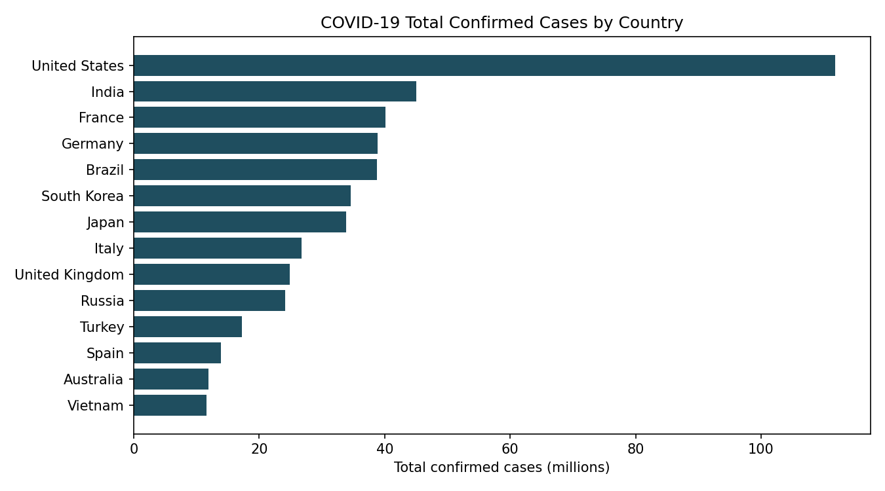
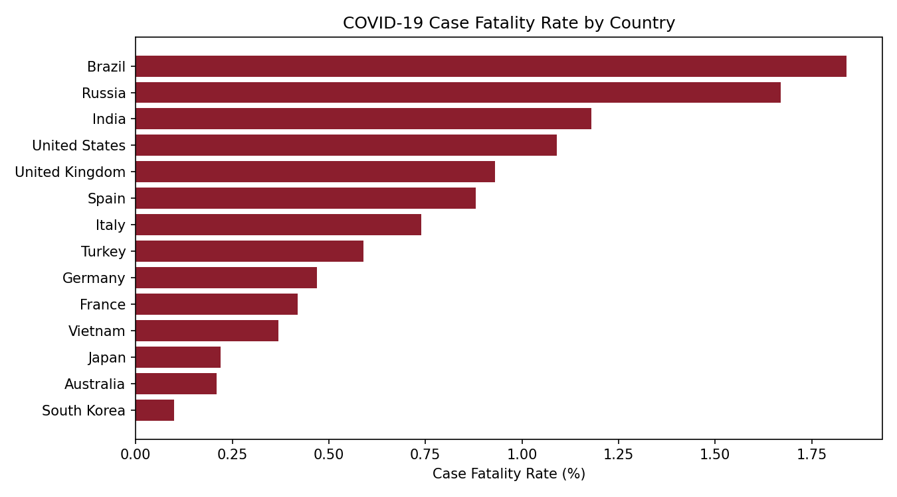

# 🦠 COVID-19 Global Impact Analysis

A Python-based data analysis project that explores the global impact of COVID-19 using country-level case and death data. The project focuses on comparing reported COVID-19 cases and Case Fatality Rate (CFR) across selected countries through data processing and visualization.

## 📌 Project Overview

The **COVID-19 Global Impact Analysis** project uses Python and Pandas to analyze country-level COVID-19 statistics.

The analysis focuses on two key metrics:

* 🌍 Total confirmed COVID-19 cases
* ⚕️ Case Fatality Rate (CFR)

The project cleans the dataset, calculates the Case Fatality Rate for each country, ranks countries according to the selected metrics, and generates visual charts using Matplotlib.

## 🎯 Objectives

The main objectives of this project are to:

* Analyze reported COVID-19 cases across countries
* Compare the number of confirmed cases
* Calculate Case Fatality Rate (CFR)
* Identify countries with higher reported case counts
* Compare CFR values between countries
* Present the results through easy-to-understand visualizations
* Practice real-world data cleaning, analysis, and visualization using Python

## 🛠️ Technologies Used

| Technology    | Purpose                                           |
| ------------- | ------------------------------------------------- |
| 🐍 Python     | Data analysis and scripting                       |
| 🐼 Pandas     | Data loading, cleaning, sorting, and calculations |
| 📊 Matplotlib | Data visualization                                |
| 📁 CSV        | Country-level COVID-19 dataset                    |

## 📂 Project Structure

```text
COVID19Analysis/
│
├── analyze.py
├── covid19_country_data.csv
├── cases_by_country.png
├── cfr_by_country.png
└── README.md
```

### File Description

**`analyze.py`**

Main Python analysis script. It:

1. Loads the COVID-19 dataset
2. Removes missing values
3. Calculates Case Fatality Rate
4. Sorts countries by total cases
5. Sorts countries by CFR
6. Displays the top 5 countries for each metric
7. Generates two visualizations

**`covid19_country_data.csv`**

Country-level COVID-19 data containing reported cases and deaths.

**`cases_by_country.png`**

Bar chart comparing total confirmed COVID-19 cases across countries.

**`cfr_by_country.png`**

Bar chart comparing Case Fatality Rate across countries.

## 📊 Analysis Methodology

### 1. Data Loading

The project loads the country-level dataset using Pandas:

```python
df = pd.read_csv("covid19_country_data.csv")
```

### 2. Data Cleaning

Missing records are removed before performing calculations:

```python
df = df.dropna()
```

### 3. Case Fatality Rate Calculation

The project calculates CFR using:

```text
CFR (%) = (Total Deaths / Total Cases) × 100
```

The calculated values are rounded to two decimal places.

### 4. Country Ranking

Countries are sorted separately according to:

* Total confirmed cases
* Case Fatality Rate

The script then displays the top five countries for each metric.

### 5. Data Visualization

Two horizontal bar charts are generated using Matplotlib:

**Total COVID-19 Cases**

Shows the number of reported confirmed cases for each country.

**Case Fatality Rate**

Shows the percentage of reported confirmed cases that resulted in reported deaths.

## 📈 Visualizations

### Total Confirmed Cases by Country



This visualization compares the reported total confirmed COVID-19 cases among the countries included in the dataset.

### Case Fatality Rate by Country



This visualization compares the calculated Case Fatality Rate across the countries in the dataset.

## 🚀 How to Run the Project

### 1. Clone the Repository

```bash
git clone https://github.com/rehanraza0063-sudo/COVID19Analysis.git
```

### 2. Open the Project

```bash
cd COVID19Analysis
```

### 3. Install Required Libraries

```bash
pip install pandas matplotlib
```

### 4. Run the Analysis

```bash
python analyze.py
```

The script will display the top five countries by total cases and Case Fatality Rate in the terminal.

It will also generate:

```text
cases_by_country.png
cfr_by_country.png
```

## 🔍 Key Analysis Areas

The project demonstrates practical experience with:

* Data cleaning
* Data preprocessing
* Pandas DataFrames
* Derived metrics
* Percentage calculations
* Sorting and ranking
* Exploratory data analysis
* Data visualization
* Python scripting
* CSV data processing

## ⚠️ Data & Interpretation Note

The analysis uses reported cumulative COVID-19 case and death figures from the dataset. Case Fatality Rate is calculated from reported cases and reported deaths and should not be interpreted as a direct measure of the underlying infection fatality rate.

Differences in testing, reporting practices, healthcare systems, population demographics, and data collection can affect comparisons between countries.

The dataset represents a historical snapshot rather than a live COVID-19 monitoring system.

## 📚 Data Source

The analysis script identifies **Worldometer's cumulative COVID-19 country totals** as its data source and notes that the dataset covers 14 countries with the highest reported case counts at the time the data was collected.

## 💡 What I Learned

Through this project, I practiced how to:

* Work with real-world public health data
* Clean datasets before analysis
* Create meaningful derived metrics
* Perform country-level comparisons
* Use Pandas for data analysis
* Create visualizations with Matplotlib
* Convert raw numerical data into understandable insights

## 🔮 Future Improvements

Possible extensions for the project include:

* Add historical time-series COVID-19 data
* Add daily cases and deaths
* Add recovery statistics
* Add vaccination data
* Add population-adjusted metrics
* Create interactive dashboards using Plotly or Power BI
* Add country and date filters
* Perform correlation analysis
* Add statistical analysis
* Build a Streamlit dashboard
* Add automated data updates from a reliable public dataset

## 👨‍💻 Author

**Rehan Raza Shaikh**

Biomedical Engineering Student | Data Analytics | AI/ML | Healthcare Technology

GitHub:
https://github.com/rehanraza0063-sudo

## ⭐ Project

If you find this project useful for learning data analysis and visualization, feel free to explore the repository and provide feedback.

---

**Built with Python, Pandas & Matplotlib**
